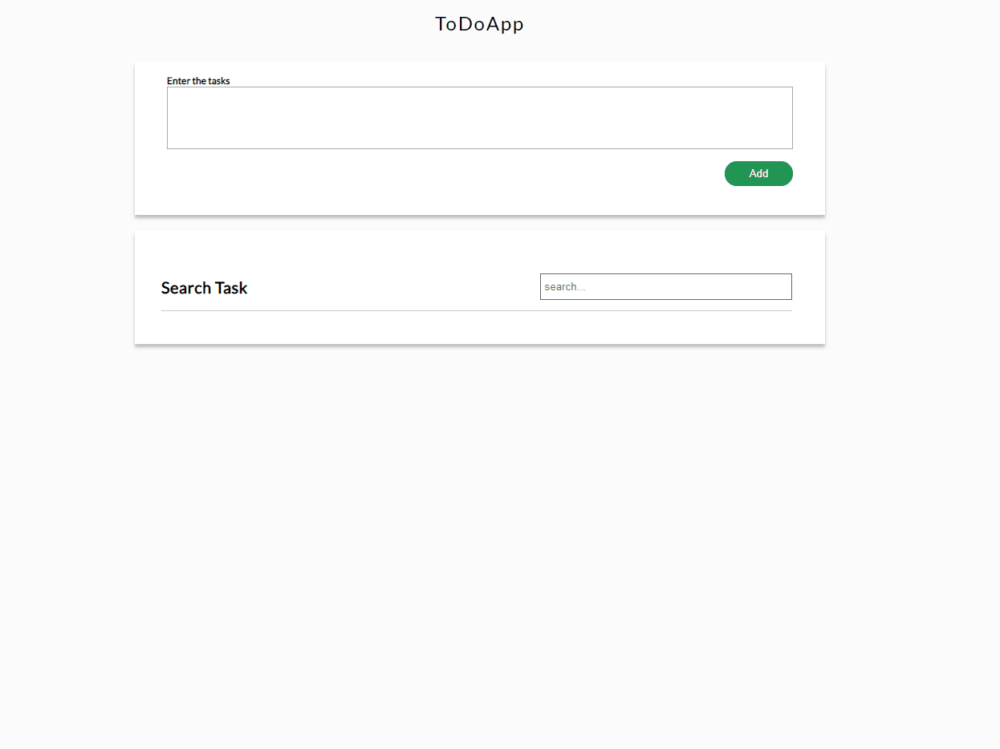

# ToDo app

Webowa aplikacja ToDo.
Aplikacja umozliwiwa dodawanie usuwanie edycję zadań.

## Demo aplikacji:

[wfrud.pl/todoapp](http://www.wfrud.pl/todoapp) 

### Użyte technologie

### Opis i Prezentacja

Kod CSS napisany został za pomocą preprocesora SASS, dzięki czemu udało się zachować porządek w kodzie. 
Aplikacja umożliwia zarządzanie zadaniami do wykonania. Możliwe są opcje dodawania, edytowania oraz usunięcie wykonanego zadania. 
Dodatkowo została zaimplementowana funkcja wyszukiwania zadań po treści zadania.  
ToDo App Składa się z 3 głównych klas:

- \_SingleNote,
- \_Storage,
- \_TaskPanel

